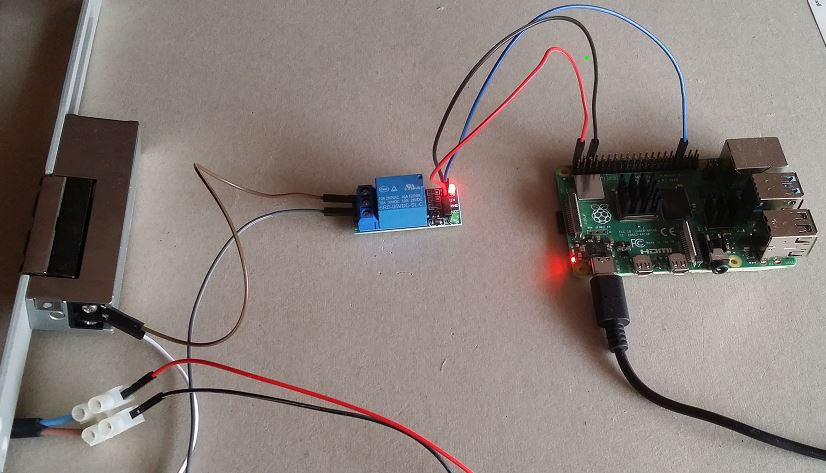

# MyPersoDoor
With this program you can open a door with your german Personalausweis.  
We use a Raspberry Pi and its GPIO-Pin that switches over a relay the doorstriker.    

Version: 0.1 
Author: buergerservice.org e.V. <KeePerso@buergerservice.org>  




-------------
requirements:
-------------
Raspberry Pi with Raspberry Pi OS bullseye  
atm (Oct 2021) bullseye is only avaiable in testversion but will be released soon https://forums.raspberrypi.com/viewtopic.php?f=29&t=317888   
program workflowClient for the admin   
AusweisApp2  
cardreader or smartphone with AusweisApp2 on the same WLAN (connect in AusweisApp2-GUI)  
for online identification ready Personalausweis - you can test it in AusweisApp2 with "Meine Daten einsehen"  
internetaccess  
1 relay  
1 12V-powersupply  
1 doorstriker
Dupont jumper cables   


-----------
connection:
-----------


-------------
installation:
-------------
copy to a directory persodoor   
first start AusweisApp2   
attach cardreader or smartphone with AusweisApp2 on the same WLAN (connect in AusweisApp2-GUI)  

start the GUI-app MyPersoDoor and register the users with "Neuer Benutzer".   

You can store one default-PIN in the menu. This default PIN works only for one person, only this person can open without PIN-input.   
WARNING: the PIN is not encrypted in PIN.txt. if you store your PIN you have to secure your raspberry pi for yourself.   

```
./MyPersoDoor (or start by mouseclick)
```


as alternative to GUI-Program MyPersoDoor you can use from shell workflowClient for registering users (but if you use MyPersoDoor you dont need!):   
start workflowClient with your PIN (in the same directory where the persodoor-program is installed)    
```
./workflowClient 123456
```
you will be asked if you want to store your PIN. The file will be overwritten. This default PIN works only for one person, only this person can open without PIN-input. WARNING: the PIN is not encrypted in PIN.txt. if you store your PIN you have to secure your raspberry pi for yourself.
all other persons should enter n at this point and activate the PIN-input in AusweisApp2 in their smartphone.    
then you will be asked if you want to store your hashkey. it will be attached to the file and other hashkeys if exist.
after that you see the certificate and your data that are read from your Personalausweis.   
now there should be a file PIN.txt and a file hashkey.txt (you see with ls)   
you can start persodoor


-----------
how to use:
-----------
start AusweisApp2  

start MyPersoDoor, you should have registered the users and maybe stored a default-PIN.   
You can see the certificate in the menu under "Info".   
The program persodoor can be started with "Starten" or stopped with "Stoppen".   


as alternative to GUI-Program MyPersoDoor you can start from shell persodoor direct (but if you use MyPersoDoor you dont need!):   
```
./persodoor
```
on your smartphone start AusweisApp2 and connect. hold personalausweis on phone.    
**DONT REMOVE YOUR PERSONALAUSWEIS FOR 10SEC TIL THE DOOR OPENS!**

between every Personalausweis-selfauthentication in persodoor it waits 15 seconds.   

it logs to persodoor.log in the same directory  


----------------------------
known problems and questions
----------------------------

is my PIN safe?  
	- you can use a cardreader with keypad or smartphone with activated PIN-input, then the plugin cant see the PIN.  

what data of my Personalausweis is used for the key?  
	like you can see in the source used are this data  
	FamilyNames (or BirthName if set)  
	GivenNames  
	DateOfBirth  
	PlaceOfBirth  
 


---------------
versionhistory:
---------------
0.1 start  


-----
build
-----
use the build-scripts ./build.sh  
to build the GUI-app MyPersoDoor in directory QtProjectMyPersoDoor you should use Qt Creator   


